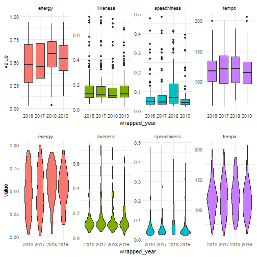
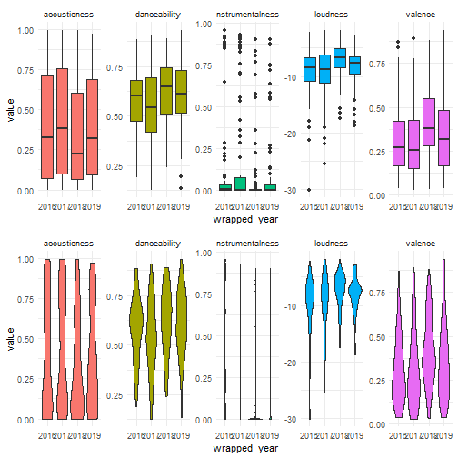
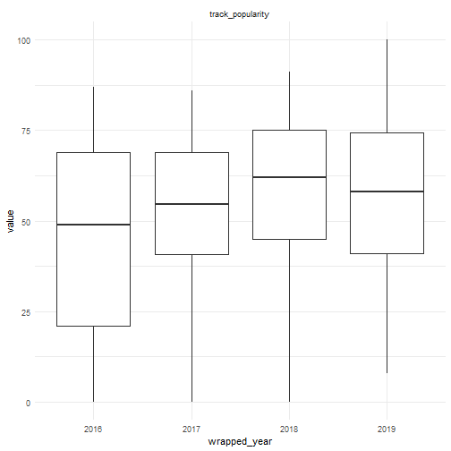
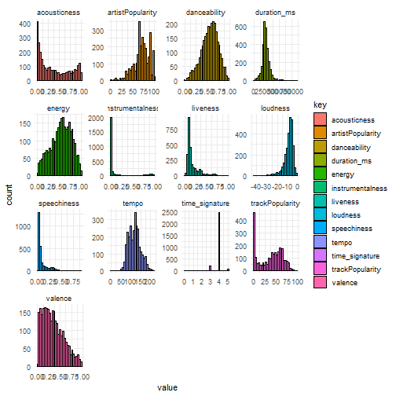
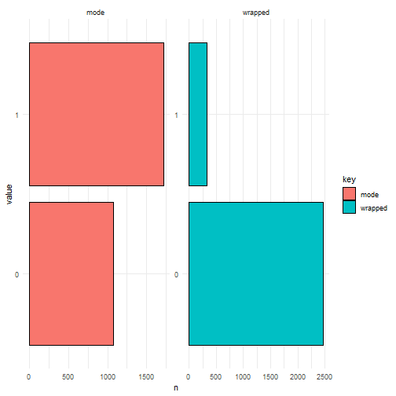
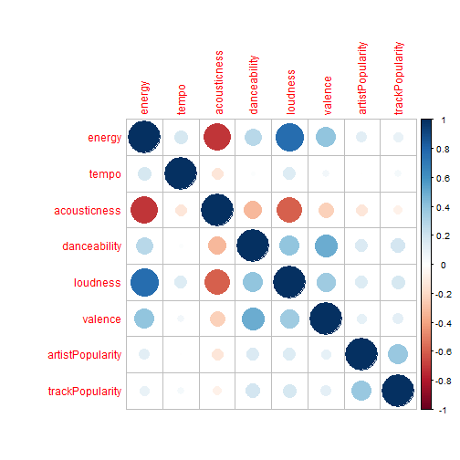
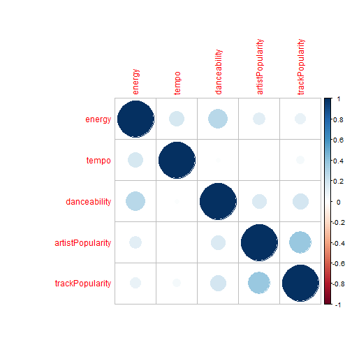
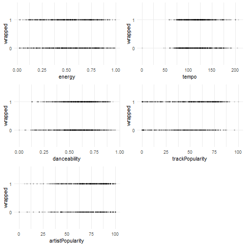

```r
library(tidyverse)
```

```
## Warning: package 'tidyverse' was built under R version 3.6.2
```

```
## Warning: package 'tidyr' was built under R version 3.6.2
```

```
## Warning: package 'purrr' was built under R version 3.6.2
```

```
## Warning: package 'dplyr' was built under R version 3.6.2
```

```r
library(plotly)
library(ggplot2)
library(gridExtra)
library(pwr)
library(corrplot)
library(DMwR)
library(InformationValue)
library(caret)
```

```
## Warning: package 'caret' was built under R version 3.6.2
```


```r
saved_songs_og <- read_csv('Kaiqi-saved.csv')
wrapped_features_og <- read_csv('wrapped_features.csv')
```

### The data

The data is obtained by utilizing the Python Spotipy package. There are two set of data, one is my yearly Spotify Wrapped playlists from 2016-2019. It contains audio information about the track and the track popularity. It is mainly used to visualize how my preference change over the years. Second dataset, Kaiqi-saved, is my spotify saved library, in addition to the variables in wrapped dataset, I also included artist popularity and genres. An dummy variable called "wrapped" indicates whether a song ended up in my year end wrapped playlist. The saved dataset is used to model how the tracks' features influence the odds the tracks being in my wrapped playlist.


```r
saved_songs <- saved_songs_og %>% 
  mutate(key = as.factor(key),
         mode = as.factor(mode),
         wrapped = as.factor(wrapped))
  
saved_songs <- saved_songs %>%
  select(-type, -uri)

wrapped <- wrapped_features_og %>% 
  select(-time_signature, -type, -uri) %>% 
  mutate(key = as.factor(key), wrapped_year = as.factor(wrapped_year))
```


### Visualize My Spotify Wrapped 2016-2019

Let's see how my preference change over the past 4 years
</br>

```r
p1 <- wrapped %>% 
  select(energy, liveness, tempo, speechiness, 
        wrapped_year) %>% 
  pivot_longer(-wrapped_year, names_to = 'key', values_to = 'value') %>% 
  ggplot()+
  geom_boxplot(mapping = aes(wrapped_year, value, fill = key), show.legend = FALSE)+
  facet_wrap(~key, ncol = 4,scales = 'free')+
  theme(legend.position = 'none')+
  theme_minimal()

p2 <- wrapped %>% 
  select(energy, liveness, tempo, speechiness, 
        wrapped_year) %>% 
  pivot_longer(-wrapped_year, names_to = 'key', values_to = 'value') %>% 
  ggplot()+
  geom_violin(mapping = aes(wrapped_year, value, fill = key), show.legend = FALSE)+
  facet_wrap(~key, ncol = 4,scales = 'free')+
  theme(legend.position = 'none')+
  theme_minimal()

grid.arrange(p1,p2, ncol = 1)
```




It seems I listen to slightly more higher energy songs in 2018.
</br>


```r
p3 <- wrapped %>% 
  select(acousticness, instrumentalness, danceability, loudness, valence,
        wrapped_year) %>% 
  pivot_longer(-wrapped_year, names_to = 'key', values_to = 'value') %>% 
  ggplot()+
  geom_boxplot(mapping = aes(wrapped_year, value, fill = key), show.legend = FALSE)+
  facet_wrap(~key, ncol = 5,scales = 'free')+
  theme(legend.position = "none")+
  theme_minimal()

p4 <- wrapped %>% 
  select(acousticness, instrumentalness, danceability, loudness, valence,
        wrapped_year) %>% 
  pivot_longer(-wrapped_year, names_to = 'key', values_to = 'value') %>% 
  ggplot()+
  geom_violin(mapping = aes(wrapped_year, value, fill = key), show.legend = FALSE)+
  facet_wrap(~key, ncol = 5,scales = 'free')+
  theme(legend.position = "none")+
  theme_minimal()

grid.arrange(p3,p4, ncol = 1)
```



Seems I was not in the mood of dancing in 2017. And the quieter songs I listening to is getting fewer and fewer. Valence , a measure of music positivity, has a higher mode in 2018.
</br>


```r
wrapped %>% 
  select(track_popularity,
        wrapped_year) %>% 
  pivot_longer(-wrapped_year, names_to = 'key', values_to = 'value') %>% 
  ggplot()+
  geom_boxplot(mapping = aes(wrapped_year, value))+
  facet_wrap(~key, ncol = 2,scales = 'free')+
  theme_minimal()
```



Track popularity remains about the same each year. A good portion of them are on the popular side in 2017, 2018, 2019.
</br>
</br>
Overall, visualy, there is no big taste change for my top 100 songs across the years.
</br>
There might be some slight changes, but are they statistically significant?
</br>

Before we start doing ANOVA tests, let's run some power analysis


```r
pwr.anova.test(k=4,n=NULL, f=0.1, sig.level = 0.05, power = 0.8)
```

```
## 
##      Balanced one-way analysis of variance power calculation 
## 
##               k = 4
##               n = 273.5429
##               f = 0.1
##       sig.level = 0.05
##           power = 0.8
## 
## NOTE: n is number in each group
```

For a small effect size, we need 274 songs for each year. Now that I learned how to interact withj Spotify API, looks like I need to get my own top 300 list at the end of each year from now on.


### Build a model

Since Spotify gave me the top songs for the past four years, and most of my top songs come from my saved songs library. I wonder if I can build a model to determine whether a song I saved to my library will become one of my top song at the end of the year.


```r
saved_songs %>%
  keep(is.numeric) %>%
  gather() %>%
  ggplot() +
  geom_histogram(mapping = aes(x=value,fill=key), color="black") +
  facet_wrap(~ key, scales = "free") +
  theme_minimal()
```

```
## `stat_bin()` using `bins = 30`. Pick better value with `binwidth`.
```



Duration, instrumentalness, liveness, speechiness and time_signature are probably not very useful. To me, when I listen to music, I don't care about duration. I don't listen to a lot of pure instrumental music, or live music. And speechiness is very useful to distinguish podcast, talk shows or audio books, but not music. For time_signature, 4 minutes just dominates other durations.


```r
saved_songs %>%
  keep(is.factor) %>%
  gather() %>%
  group_by(key,value) %>% 
  summarise(n = n()) %>% 
  ggplot() +
  geom_bar(mapping=aes(x = value, y = n, fill=key), color="black", stat='identity') + 
  coord_flip() +
  facet_wrap(~ key, scales = "free") +
  theme_minimal()
```



The dependent variable is very imbalanced.


```r
saved_songs <- saved_songs %>% 
  select(energy, tempo, acousticness, danceability, key, loudness, valence, mode,
         artistPopularity, trackPopularity, wrapped)
```


```r
saved_songs %>%
  keep(is.numeric) %>%
  cor() %>%
  corrplot()
```



Drop loudness, acousticness, and valence


```r
saved_songs1 <- saved_songs %>% 
  select(-loudness, -acousticness, -valence)

saved_songs1 %>%
  keep(is.numeric) %>%
  cor() %>%
  corrplot()
```




Since my data is imbalanced, balace it before running models.</br>

```r
set.seed(6666)
songs_balance <- SMOTE(wrapped ~ energy+tempo+danceability+artistPopularity+trackPopularity, data.frame(saved_songs1), perc.over = 100, perc.under = 200)
```

Visualize bivariate relationship between my independent variables and dependent variable.


```r
p1 <- songs_balance %>% 
  mutate(energy = energy) %>% 
  ggplot(aes(energy, wrapped))+
    geom_point(size = 1.2, alpha = 0.1)+
    theme_minimal()

p2 <- songs_balance %>% 
  ggplot(aes(tempo, wrapped))+
    geom_point(size = 1.2, alpha = 0.1)+
    theme_minimal()

p3 <- songs_balance %>% 
  ggplot(aes(danceability, wrapped))+
    geom_point(size = 1.2, alpha = 0.1)+
    theme_minimal()

p4 <- songs_balance %>% 
  ggplot(aes(trackPopularity, wrapped))+
    geom_point(size = 1.2, alpha = 0.1)+
    theme_minimal()

p5 <- songs_balance %>% 
  ggplot(aes(artistPopularity, wrapped))+
    geom_point(size = 1.2, alpha = 0.1)+
    theme_minimal()

grid.arrange(p1,p2,p3,p4,p5, ncol = 2)
```



It is very easy to see whether each variable has effect. Lets model it using GLM.


```r
logit_mod1 <-
  glm(wrapped ~ tempo+energy+danceability+artistPopularity+trackPopularity, family = binomial(link = 'logit'), data = songs_balance)
summary(logit_mod1)
```

```
## 
## Call:
## glm(formula = wrapped ~ tempo + energy + danceability + artistPopularity + 
##     trackPopularity, family = binomial(link = "logit"), data = songs_balance)
## 
## Deviance Residuals: 
##    Min      1Q  Median      3Q     Max  
## -1.732  -1.133   0.112   1.080   1.838  
## 
## Coefficients:
##                   Estimate Std. Error z value Pr(>|z|)    
## (Intercept)      -0.602663   0.361853  -1.665  0.09581 .  
## tempo             0.002116   0.002088   1.014  0.31081    
## energy           -0.724013   0.278145  -2.603  0.00924 ** 
## danceability      1.096513   0.356197   3.078  0.00208 ** 
## artistPopularity -0.015104   0.003705  -4.077 4.56e-05 ***
## trackPopularity   0.025130   0.002835   8.866  < 2e-16 ***
## ---
## Signif. codes:  0 '***' 0.001 '**' 0.01 '*' 0.05 '.' 0.1 ' ' 1
## 
## (Dispersion parameter for binomial family taken to be 1)
## 
##     Null deviance: 1802.2  on 1299  degrees of freedom
## Residual deviance: 1691.4  on 1294  degrees of freedom
## AIC: 1703.4
## 
## Number of Fisher Scoring iterations: 4
```

Tempo is not a significant variable, remove it.


```r
logit_mod2 <-
  glm(wrapped ~ energy+danceability+artistPopularity+trackPopularity, family = binomial(link = 'logit'), data = songs_balance)
summary(logit_mod2)
```

```
## 
## Call:
## glm(formula = wrapped ~ energy + danceability + artistPopularity + 
##     trackPopularity, family = binomial(link = "logit"), data = songs_balance)
## 
## Deviance Residuals: 
##      Min        1Q    Median        3Q       Max  
## -1.70821  -1.13831   0.08452   1.07199   1.86696  
## 
## Coefficients:
##                   Estimate Std. Error z value Pr(>|z|)    
## (Intercept)      -0.377399   0.284939  -1.324  0.18534    
## energy           -0.654329   0.269344  -2.429  0.01513 *  
## danceability      1.081229   0.355583   3.041  0.00236 ** 
## artistPopularity -0.015194   0.003703  -4.103 4.07e-05 ***
## trackPopularity   0.025224   0.002834   8.902  < 2e-16 ***
## ---
## Signif. codes:  0 '***' 0.001 '**' 0.01 '*' 0.05 '.' 0.1 ' ' 1
## 
## (Dispersion parameter for binomial family taken to be 1)
## 
##     Null deviance: 1802.2  on 1299  degrees of freedom
## Residual deviance: 1692.5  on 1295  degrees of freedom
## AIC: 1702.5
## 
## Number of Fisher Scoring iterations: 4
```


```r
exp(coef(logit_mod2))
```

```
##      (Intercept)           energy     danceability artistPopularity 
##        0.6856423        0.5197909        2.9483013        0.9849207 
##  trackPopularity 
##        1.0255452
```

Now I have a pretty significant model. It seems energy and artistPopularity has some negative effect in the odds of being my top song. Holding other variable constant, for every unit increase in energy, the odds being my top song decrease by 63%. And for every unit increase in artist popularity, the odds of the song being my top song decrease by 2%. And danceability and trackPopularity do increase the odd of being my top song. 
</br>
Even I don't want to admit it, my model says I like danceable and popular songs. And it say I don't like high energy song and popular artists.
</br>

### Machine learning approach to evaluate the performance

Since R^2 is not supported in logistic regression, and the package of getting pseudo R^2 is not recommended. Let's use a machine learning apporoach to evaluate the accuracy.

create training and test datasets

```r
set.seed(1234)
sample.set <- createDataPartition(saved_songs1$wrapped, p = 0.75, list = FALSE)
songs.train <- saved_songs1[sample.set, ]
songs.train <- SMOTE(wrapped ~ ., data.frame(saved_songs1), perc.over = 100, perc.under = 200)
songs.test <- saved_songs1[-sample.set, ]
```


```r
logit_mod3 <-
  glm(wrapped ~ energy+danceability+artistPopularity+trackPopularity, family = binomial(link = 'logit'), data = songs.train)
summary(logit_mod3)
```

```
## 
## Call:
## glm(formula = wrapped ~ energy + danceability + artistPopularity + 
##     trackPopularity, family = binomial(link = "logit"), data = songs.train)
## 
## Deviance Residuals: 
##     Min       1Q   Median       3Q      Max  
## -1.8027  -1.1464   0.0625   1.0563   1.9090  
## 
## Coefficients:
##                   Estimate Std. Error z value Pr(>|z|)    
## (Intercept)      -0.500920   0.291792  -1.717 0.086034 .  
## energy           -0.588408   0.263438  -2.234 0.025511 *  
## danceability      0.942511   0.356051   2.647 0.008118 ** 
## artistPopularity -0.014555   0.003787  -3.844 0.000121 ***
## trackPopularity   0.028588   0.002758  10.367  < 2e-16 ***
## ---
## Signif. codes:  0 '***' 0.001 '**' 0.01 '*' 0.05 '.' 0.1 ' ' 1
## 
## (Dispersion parameter for binomial family taken to be 1)
## 
##     Null deviance: 1802.2  on 1299  degrees of freedom
## Residual deviance: 1659.9  on 1295  degrees of freedom
## AIC: 1669.9
## 
## Number of Fisher Scoring iterations: 4
```


```r
exp(coef(logit_mod2))
```

```
##      (Intercept)           energy     danceability artistPopularity 
##        0.6856423        0.5197909        2.9483013        0.9849207 
##  trackPopularity 
##        1.0255452
```

Similar result.

Now let's find the optimal cutoff


```r
logit_pred <- predict(logit_mod3, songs.test, type = 'response')
ideal_cutoff <-
  optimalCutoff(
    actuals = songs.test$wrapped,
    predictedScores = logit_pred,
    optimiseFor = "Both"
  )

ideal_cutoff
```

```
## [1] 0.5253408
```

Let's evaluate the performance</br>

```r
logit_pred <- ifelse(logit_pred > ideal_cutoff, 1, 0)
logit.matrix <-confusionMatrix(as.factor(logit_pred), songs.test$wrapped, positive = '1')
logit.matrix
```

```
## Confusion Matrix and Statistics
## 
##           Reference
## Prediction   0   1
##          0 372  31
##          1 244  50
##                                           
##                Accuracy : 0.6055          
##                  95% CI : (0.5681, 0.6419)
##     No Information Rate : 0.8838          
##     P-Value [Acc > NIR] : 1               
##                                           
##                   Kappa : 0.1033          
##                                           
##  Mcnemar's Test P-Value : <2e-16          
##                                           
##             Sensitivity : 0.61728         
##             Specificity : 0.60390         
##          Pos Pred Value : 0.17007         
##          Neg Pred Value : 0.92308         
##              Prevalence : 0.11621         
##          Detection Rate : 0.07174         
##    Detection Prevalence : 0.42181         
##       Balanced Accuracy : 0.61059         
##                                           
##        'Positive' Class : 1               
## 
```

```r
accuracy <- as.numeric(logit.matrix$overall["Accuracy"])
accuracy
```

```
## [1] 0.6054519
```

```r
kappa <- as.numeric(logit.matrix$overall["Kappa"])
kappa
```

```
## [1] 0.1032623
```

Even though the accuracy is not bad, the Kappa is very low. A lot of the correct predictions are probably made just by chance.
</br>

### Bayesian Logistic Regression

Let's use Bayesian Data Analysis

```r
library(rstanarm)
```

```
## Warning: package 'rstanarm' was built under R version 3.6.2
```

```
## Warning: package 'Rcpp' was built under R version 3.6.2
```


```r
bLog = stan_glm(wrapped ~ energy+danceability+artistPopularity+trackPopularity, data = songs_balance, family = binomial,
              prior = student_t(df = 5, location = 0, scale = 2.5), 
              prior_intercept = student_t(df = 5, location = 0, scale = 2.5), 
              seed = 10001, chains = 6,
              cores = (parallel::detectCores() - 1),
              iter = 4000)

summary(bLog)
```

```
## 
## Model Info:
##  function:     stan_glm
##  family:       binomial [logit]
##  formula:      wrapped ~ energy + danceability + artistPopularity + trackPopularity
##  algorithm:    sampling
##  sample:       12000 (posterior sample size)
##  priors:       see help('prior_summary')
##  observations: 1300
##  predictors:   5
## 
## Estimates:
##                    mean   sd   10%   50%   90%
## (Intercept)      -0.4    0.3 -0.7  -0.4   0.0 
## energy           -0.7    0.3 -1.0  -0.7  -0.3 
## danceability      1.1    0.4  0.6   1.1   1.5 
## artistPopularity  0.0    0.0  0.0   0.0   0.0 
## trackPopularity   0.0    0.0  0.0   0.0   0.0 
## 
## Fit Diagnostics:
##            mean   sd   10%   50%   90%
## mean_PPD 0.5    0.0  0.5   0.5   0.5  
## 
## The mean_ppd is the sample average posterior predictive distribution of the outcome variable (for details see help('summary.stanreg')).
## 
## MCMC diagnostics
##                  mcse Rhat n_eff
## (Intercept)      0.0  1.0  16863
## energy           0.0  1.0  12959
## danceability     0.0  1.0  13688
## artistPopularity 0.0  1.0  11950
## trackPopularity  0.0  1.0  11627
## mean_PPD         0.0  1.0  12428
## log-posterior    0.0  1.0   5588
## 
## For each parameter, mcse is Monte Carlo standard error, n_eff is a crude measure of effective sample size, and Rhat is the potential scale reduction factor on split chains (at convergence Rhat=1).
```

The mean of the coefficients are similar to GLM results. And the Rhat is also very good. 
</br>
Check out posterior intervals:


```r
posterior_interval(bLog, prob = 0.95, pars = c('energy', 'danceability', 'artistPopularity','trackPopularity'))
```

```
##                         2.5%        97.5%
## energy           -1.19478122 -0.112840644
## danceability      0.40998222  1.790827063
## artistPopularity -0.02264516 -0.008090892
## trackPopularity   0.01982764  0.030861793
```

None of them crosses zero, a good sign.
</br>
I do have a strong preferance of dancable songs. However, not a good dancer.
</br>

### More to do

1. Do bootstrapping on GLM and see how bootstrapping CI for the coefficients differ from Bayesian CIs.
</br>
</br>
2. Even though the model has good accuracy. There is still room to improve both accuracy and fututure performance. Try some machine learning algorithms such as decision tree, random forest or AdaBoost.
</br>
</br>
3. Mixed model or interactions are worth exploring, but I need more data of myself to have good result.
</br>
</br>
4. Gather other users data, and see how the models differ.
</br>
</br>
5. Build something that can generalize to different users on Spotify


